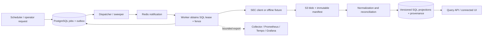

# SECRecon: implementation handoff and deployment roadmap

Prepared 2026-09-19. Read this on a new machine before implementing anything.

## 1. Where we are

SECRecon ingests SEC filings, preserves source evidence, normalizes financial assertions, reconciles original/amended filings, and exposes financial queries plus an auditable operator interface. The portfolio story is correctness under duplication, late arrival, schema changes and failures. Visual polish supports that story; it is not the main deliverable.

**M0–M5 are complete. M6 and M7 are not started.** The next implementation slice is **M6.1: repeatable isolated failure harness**. Do not restart the ingestion pipeline or replace the existing architecture.

| Baseline | Verified position |
| --- | --- |
| Private repository | [adityaanantharaman16/SECRecon](https://github.com/adityaanantharaman16/SECRecon) |
| Default branch | `main` |
| Last implementation commit | `5be2ba887f250368057cde34410bba66017bb426` — M5 squash merge; later documentation commits may follow |
| M5 review | [PR #2, merged](https://github.com/adityaanantharaman16/SECRecon/pull/2) |
| Verified main CI | [Run 35112209686, successful](https://github.com/adityaanantharaman16/SECRecon/actions/runs/35112209686); verified again 2026-09-19 |
| Database head | Alembic `0006` |
| Full local M5 gate | 94 tests passed; 91.18% combined statement/branch coverage of domain/job modules, not whole-repository coverage |
| Final focused audit | 14 API/telemetry tests passed; lint, formatting, strict types, alert tests and browser checks passed |
| Release status | Development stack works; no completed M7 release/deployment system or `v0.1.0` release gate is claimed |

The package metadata already says `0.1.0`; that does **not** mean the release milestone passed. Test counts and timings above are historical evidence, not a claim that tests were rerun on the receiving machine.

This document is a consolidated starting point. [PROJECT_STATE.md](PROJECT_STATE.md) is the living progress record; [PROJECT_GUIDE.md](PROJECT_GUIDE.md) owns milestone gates and long-term scope. ADRs explain why the design exists. Older ADRs/session entries describe their milestone at the time; ADR 0004 and the current state supersede older statements that UI/authentication are still future work. Explicit owner instructions override these defaults.

## 2. Owner preferences and boundaries

- The name is **SECRecon**. The original local folder is `SECReconcile`; a clone can have any folder name. Do not rename the product to LedgerFlow/FilingWatch.
- Required runtime is **local and free**. No required cloud service, Kubernetes, Kafka migration, hosted database or paid account.
- The existing GitHub repository is private. Project Git work is authorized; new public visibility, paid resources and public backend exposure are not implied.
- Branch names must **exclude `codex`**. Use `feat/m6-fault-harness`, `test/...`, `fix/...`, or `docs/...`.
- Use small reviewable slices, descriptive milestone commits, PR review and squash merges. Solo audit is acceptable; do not require a second reviewer who does not exist. Do not weaken gates merely to make CI pass.
- Preserve the navy/blue/off-white palette. `demo/` is an independent fictional design prototype. The actual UI uses Jinja2 at port 8000; the demo is not a fixed visual specification or a backend substitute.
- Keep explaining what the owner can demonstrate and why the mechanism matters. Update project state after each implementation session.
- Vercel was mentioned as an optional future presentation host. It is not a selected backend deployment target. Public hosting is not required to finish M7.

## 3. Move to another machine

### What Git carries, and what it does not

Git carries application source, migrations, frozen dependencies, Compose files, dashboards, tests, small recorded/synthetic fixtures, the demo and documentation. It does **not** carry `.env`, credentials, `.venv`, `.tools`, `.local`, PostgreSQL data, S3 archive volumes, Redis state, local logs, backups or retained traces. The ignored GitHub helper scripts used on the original computer are not project tooling; use normal Git/GitHub tooling authenticated on the new machine.

**A fresh local workspace is sufficient to continue implementation.** It can recreate test/demo data from committed fixtures. If preserving the old machine's exact operational history matters, use the separate transfer procedure below; cloning alone does not transfer it.

### Fresh workspace: executable setup

Prerequisites: access to the private repository, Git, Docker Engine with Compose v2 and Linux containers, and Python to run the standard-library bootstrap script. Docker contains the Python 3.12 application runtime. On Windows use Docker Desktop's Linux engine; on another OS use the corresponding local Docker installation. Initial image/package downloads require Internet access; the tests themselves do not request SEC.

Run from a chosen parent directory:

```text
git clone https://github.com/adityaanantharaman16/SECRecon.git
cd SECRecon
git switch main
git pull --ff-only
git status --short
python scripts/bootstrap.py
docker compose config --quiet
docker compose up -d --build
docker compose ps
```

Use `python3` if that is the Python command on the new machine. On the original Windows computer, `py -3.13` ran bootstrap; the **application package requires Python >=3.12,<3.13**. Do not install the application into Python 3.13 just because bootstrap runs there.

Open `http://localhost:8000/health/ready`; expect `{"status":"ready","schema":"0006"}` at this baseline. Then open `http://localhost:8000` and `/docs`. Check service logs if readiness fails; do not reset volumes as a first troubleshooting step.

Bootstrap creates random local credentials and adds a missing operator token without overwriting an existing environment. Start with `SECRECON_SEC_MODE=offline`. Use `SECRECON_ADMIN_TOKEN` from the local ignored `.env` for **Operator sign-in**. Do not paste it into prompts, screenshots or commits.

Create fictional demonstration data and the default watchlist:

```text
docker compose run --build --rm test python scripts/seed_demo.py
docker compose run --rm api secrecon watchlist seed
```

The seed writes synthetic data into the development database/archive. Repeating it adds capture provenance without duplicating financial assertions. A newly cloned database is otherwise empty; real recorded fixtures are exercised by tests and are not automatically a populated development database.

Run the baseline gate in its own Compose project:

```text
docker compose -p secrecon-test -f compose.yaml -f compose.test.yaml run --build --rm test
python scripts/service_drills.py
docker compose -p secrecon-test -f compose.yaml -f compose.test.yaml stop
```

Run the service drill after the first command succeeds, while its dependencies still exist/running. It is currently hard-coded to `secrecon-test`, not an arbitrary project. It stops PostgreSQL and restarts object storage only in that test project. The full gate intentionally creates/drops an isolated temporary database and kills test worker processes. Never substitute the development project for the test project.

Optional local observability:

```text
docker compose -f compose.yaml -f compose.observability.yaml --profile observability up -d --build
```

Grafana: `http://localhost:3000`; Prometheus: `http://localhost:9090`. The API, Grafana and Prometheus bind to loopback. Database, Redis and S3 ports are internal by default. `compose.dev.yaml` provides reload/debug ports, but is unnecessary for the basic workflow. Ports can conflict with other projects on a new machine; inspect before editing, and record any override.

For host-side development, install Python 3.12 and uv, then `uv sync --frozen` and `uv run python scripts/check.py`. Host integration tests skip without enabled/configured dependencies; a green host-only run does not replace the container gate. There is no required Node/React build for the connected UI. Exact dependencies live in `uv.lock`; do not refresh the entire lockfile as part of moving machines.

### Existing-data transfer: a separate operation

This is a transfer plan, **not an already automated or rehearsed migration utility**. M7 must turn it into a tested runbook/tool.

1. On the source machine, identify the actual Compose project/volumes, Git revision, schema, active generation, parser version and configuration. Pause scheduling and quiesce workers so database/raw inventory can be captured at a documented cutoff.
2. Take a fresh PostgreSQL backup and preserve the corresponding complete raw blobs/manifests. Record counts, inventory checksums, canonical financial digest and operational audit counts. Do not copy a running PostgreSQL data directory as if it were a consistent backup.
3. Transfer those artifacts through storage controlled by the owner. Protect backups because they contain operator/session/history data. Keep secrets separate from the repository and agent prompts. Redis and telemetry are not substitutes for either authoritative backup.
4. Restore into a **new isolated target**, with compatible images/configuration and SEC offline. Verify checksums, schema, facts/provenance, active generation, jobs/attempts/admin history and the backup cutoff before resuming. Re-notify outstanding SQL work through the existing dispatcher/sweeper instead of assuming copied Redis state establishes ownership.
5. Rotate target credentials deliberately, account for database/S3 credentials used by the restored services, and validate authentication. Preserve the source environment until the target is verified. Do not run two live SEC schedulers concurrently.

The old `.local/backups/secrecon-pre-m5.dump` is a **pre-M5** snapshot, is ignored, and is not a current backup or complete raw archive. Archive-only replay reconstructs financial output/provenance; it cannot invent the operational history or on-demand comparisons lost with PostgreSQL. Same-disk backups do not protect against host/disk loss.

## 4. Current stack and end-to-end flow

| Concern | Implemented choice | Reason / constraint |
| --- | --- | --- |
| Language/processes | Python 3.12; one package/image, separate API, worker and scheduler | Independent failure boundaries without multiple services/codebases |
| API/UI | FastAPI, Pydantic, Jinja2, local CSS/minimal JavaScript | Query and restrained operator interface; Swagger assets are vendored for offline use |
| Database | PostgreSQL 17, SQLAlchemy 2, psycopg, Alembic | Authoritative state, transactions, locks and NUMERIC values |
| Delivery | Redis 7.4 Streams | Work notification; SQL supplies durability and exclusive ownership |
| Raw storage | S3-compatible SeaweedFS | Content-addressed blobs and create-only event manifests |
| Local runtime | Docker Compose | No cloud dependency; shared runtime/test builds and separate volumes per project |
| Telemetry | OpenTelemetry SDK/Collector; Prometheus; Grafana; Tempo | Local metrics, logs and traces; optional profile |
| Verification | pytest, Hypothesis, Ruff, strict mypy, coverage, real dependencies | Financial/correctness invariants, not mock-only demonstrations |
| CI | GitHub Actions `ci.yml` | Separate `checks` and `observability` jobs; no deployment workflow yet |

Image digests are pinned in Compose/Dockerfile. Compatible Python resolutions are in `uv.lock`; those files are authoritative rather than this document's version summary. Do not substitute SQLite for PostgreSQL or MinIO for the tested S3 backend without a deliberate decision and validation.



Raw capture/registration and normalization are distinct recoverable stages. The diagram does not imply a distributed transaction spanning S3, Redis and PostgreSQL.

### Contracts to preserve

**Sources and identity.** Preserve decoded response-body bytes, source URL, request/fetch times, SHA-256 and manifest version. Content identity and capture identity are different: identical bytes can have multiple capture events. A manifest marks a complete archive event; a lone blob is not treated as a completed capture. Inventory repair can register committed manifests and notify normalization. Local administrators can still alter the storage volume; application immutability is not administrator-proof WORM.

**Financial data.** Preserve exact decimals (SQL NUMERIC, JSON/API strings); never round through binary float. Fact identities are canonical and repeatable. Keep source locators, parser version, accession and generation. A snapshot commit is atomic, with per-company/per-generation serialization because Company Facts spans multiple filings. Source history is retained, not overwritten with a newest-value row.

**Jobs.** Job/outbox records commit together. PostgreSQL row locks, lease expiry and monotonically increasing fencing tokens protect effects; a Redis consumer claim or heartbeat is insufficient. Defaults are a 60-second lease and 15-second heartbeat. Attempts, retries and state transitions are durable; transient errors back off, terminal failures are inspectable. Redrive creates a linked job and preserves the failed history. Queue loss is repaired from SQL unfinished work. Commit-before-ack duplication must remain harmless.

**Ingestion.** Submissions discovery, historical pages, primary documents, Company Facts, watchlist polling and bounded backfills exist. Historical checkpoints and child jobs commit atomically. Backfills prioritize incremental work and track linked normalization; cancellation stops new source work but preserved captures may still normalize. The filing-date window bounds discovery/documents, not the aggregate contents of Company Facts. Missing facts have bounded enrichment revisits and an explicit unavailable outcome.

**Scope.** Default watchlist: Apple, Microsoft, Alphabet, Amazon and Rivian; maximum configured size 25. Target forms: 10-K/10-Q and amendments; initial scope two years. Supported financial coverage is entity-wide US-GAAP Company Facts, not all filing XBRL, custom taxonomy, segment dimensions or complete statement restatements. Primary HTML documents are preserved as evidence, not parsed to promise full numerical coverage.

**Reconciliation.** Explicit pairs require the same CIK, base form and known report date plus valid chronology. Automatic candidates are unique, ambiguous or unresolved; never choose a convenient newest original to hide ambiguity. Each side binds to one successful Company Facts snapshot. Default selection uses latest fetch time/event ID even if the accession has no facts there; it does not fall back to an older nonempty snapshot. Compare taxonomy/concept/unit/instant-or-duration/start/end keys. Conflicting values remain ambiguous. Missing amendment facts are coverage gaps, never zero/deletion. Preserve immutable comparison runs and source evidence; current-pointer tables may advance.

**Replay/schema evolution.** Fixed manifest inventory, parser/comparison versions and separate target generation; checkpoint and validate checksums. Promotion requires the expected digest and rejects stale inventories if active ingestion advanced. Active writes coordinate with promotion. `sec-json-v1` remains default; `sec-json-v2` demonstrates strict numeric-string accommodation in a synthetic upstream change. Raw bytes and prior quarantine remain intact. V1/v2 rejects booleans, nonfinite and pathological numbers; current bounds are 1,000 digits and absolute exponent 1,000. M3 digest/replay records are incompatible with M4's added reconciliation output; create a fresh baseline rather than resuming legacy records.

**Replay boundary.** Canonical digests include financial data, provenance and current automatic reconciliation, excluding generated times/IDs as documented. They do not reconstruct job attempts, operator requests, sessions or historical on-demand comparison requests. Restore those from PostgreSQL backups.

### Query and operator contracts

- Public loopback financial resources: `/v1/companies`, `/v1/filings`, `/v1/facts`, `/v1/amendments`, `/v1/sources`, plus filing detail, fact provenance and `/v1/reconciliations/{id}`.
- Protected resources: `/v1/admin/jobs`, quarantine, backfills, replays, operation status; POST comparison/backfill/replay/redrive/cancel actions.
- Lists use allowlisted parameterized SQL and keyset cursors, default 50/max 200. Cursors validate resource/filters and pin generation; they do not freeze a database snapshot against later inserts. Comparison/provenance have separate bounded traversal. Embedded evidence caps at 200 and discloses truncation. Source accession search includes linked aggregate captures.
- Financial values are assertions, not an implicit latest-value feed. Responses disclose generation/freshness/coverage. List queries use a five-second timeout; DB connections default to 30 seconds. Errors carry sanitized messages/request IDs.
- API administration uses a random bearer token. Browser sessions are hashed in PostgreSQL, expire after eight hours, use HttpOnly/SameSite=Strict cookies, and require CSRF/origin checks for mutation. Token rotation invalidates old sessions. Empty token disables administration.
- POST requires `Idempotency-Key`: same key/action/body returns the same operation/job IDs; changed body returns 409. Audit/job/outbox commit together, return 202, and workers execute under fenced ownership. Web replay creates a new candidate generation; it cannot promote it.
- Raw filing HTML is never executed on the app origin. Templates autoescape source content, use CSP and host allowlisting. Current HTTP cookies/bindings are for localhost; public HTTPS deployment needs deliberate configuration and access-control work.

Exact route schemas are in `/docs` and `api/schemas.py`. The [UI runbook](runbooks/OPERATIONS_UI.md) has filters, example request bodies and the owner walkthrough.

### Observability contracts

Trace context persists with jobs and attempts and links fetch, archive, enqueue, processing and projection spans. Failed attempts set error status even when exceptions are handled. SQL history stays authoritative during exporter failure.

Each process has bounded 256-item span/log queues with nonblocking offers, background exporters and one-second HTTP timeouts. Drops/failures are measurable. SQL metrics distinguish eligible backlog from future retries and Redis deliveries. Avoid job/accession/event identifiers as metric labels. Current ingestion-lag metric is maximum capture-to-normalization duration among successful processing in 24 hours; it is **not** SEC acceptance lag or the proposed M6 p95 discovery-lag measurement.

Prometheus retains seven days/512 MB; Tempo uses local storage with default 14-day retention. Collector queues/memory/retries and Docker logs are bounded. Logs use sampled Collector output; no Loki/searchable log backend. Alerts expose state in Prometheus; no notification delivery service is configured. Offline/no-traffic and powered-off-computer behavior must remain explicit.

Grafana is loopback-only anonymous Viewer. Jobs link to the provisioned **SECRecon Trace** dashboard because this Viewer cannot use Explore. Do not solve navigation problems by granting editing/admin permissions. Old attempts may lack traces; expired telemetry cannot be regenerated as historical traces merely by restoring SQL.

## 5. Code and evidence map

| Path | Start here for |
| --- | --- |
| `src/secrecon/config.py`, `runtime.py`, `cli.py`, `commands/` | Settings, process wiring and implemented CLI commands |
| `ingestion/client.py`, `rate_limit.py`, `adapters.py` | SEC boundaries, throttling and versioned schema extraction |
| `storage/archive.py` | Immutable blobs/manifests, checksums and inventory |
| `jobs/store.py`, `worker.py`, `queue.py`, `handlers.py` | SQL ownership, fences/retries/outbox, Redis delivery and handlers |
| `orchestration/planner.py`, `replay.py`, `operations.py` | Polling/backfills, generations/replay and durable admin actions |
| `domain/types.py`, `domain/reconciliation.py` | Financial identity, decimal and comparison rules |
| `db/projections.py`, `reconciliation.py`, `generations.py`, `queries.py`, `transactions.py` | SQL projection/reconciliation, generation control, pagination and shared transactions |
| `api/` and `api/templates/`, `api/assets/` | Routes, schemas, auth, errors and connected UI |
| `telemetry/`, `ops/` | SDK/export isolation, SQL metrics, Collector, dashboards and alert fixtures |
| `migrations/versions/` | 0001 foundation; 0002 sources/projections; 0003 jobs; 0004 orchestration; 0005 reconciliation; 0006 operations |
| `tests/integration/test_crashes.py`, `test_worker_failures.py`, `test_jobs.py` | Existing fault boundaries to reuse for M6 |
| `test_empty_database_replay.py`, `test_orchestration.py`, `test_reconciliation.py` | Empty-DB replay, upgrades, backfills, schema and history invariants |
| `test_operations_api.py`, `test_telemetry_pipeline.py` | M5 operator/auth/query/trace/export-failure guarantees |
| `scripts/fault_worker.py`, `outage_probe.py`, `service_drills.py` | Existing fault helpers; not yet a comprehensive M6 harness |
| `scripts/seed_demo.py`, `observability_smoke.py` | Synthetic local demonstrations; smoke appends data and does not contact SEC |
| `tests/fixtures/recorded/README.md` | Exact real captures and manual financial verification |
| `docs/adr/0001-*.md` through `0004-*.md` | Runtime, ownership/replay, reconciliation/schema, operations/telemetry decisions |
| `docs/evidence/M0.md` through `M5.md`, `CI.md` | Completed gates and historical results |

Paths abbreviated in the table's middle rows are relative to `src/secrecon/` or `tests/integration/` as indicated. Current tests live in `tests/unit/` and `tests/integration/`; the guide's `tests/contract`, `tests/e2e`, `tests/fault` and `benchmarks/` layout is a target, not a claim those directories exist. Likewise `secrecon drill` and `secrecon deploy` are planned commands, not executable today.

Recorded fixtures cover Amazon, Rivian and a real Robinhood original/amendment pair. Robinhood's amendment changes formatting without changing financial results. Do not replace that evidence with a synthetic changed-value example while claiming it is real SEC behavior. Fixtures are already committed; new live requests are unnecessary for M6.

## 6. Remaining roadmap: M6 reliability evidence

All slices below are **remaining work**, not delivered functionality. Implement and validate one reviewable slice at a time, preserving the current gates.

### M6.1 — Repeatable fault harness

**Deliver:** a bounded runner/report format around existing helpers, an explicitly named isolated Compose target, and the required fault scenarios. Refuse development/release projects; resolve actual targets before destructive steps. Use copies for corruption. Record Git/image/schema/parser identity, dataset seed/inventory, resources, UTC times, scenario, fault point, expected invariants, SQL before/after, event/job/trace IDs, elapsed recovery and outcome. Clean up only owned test processes/resources and report cleanup failures.

Use explicit readiness/checkpoint predicates, controllable clocks where appropriate and deadlines. Do not make arbitrary sleeps the evidence that a fault hit the intended point. Live SEC access must be off. Assert safety behavior before exercising destructive helpers.

| Scenario | Required result |
| --- | --- |
| Duplicate deliveries to multiple workers | One committed financial effect; visible duplicate delivery/recovery |
| Kill before SQL commit | Lease expires; another worker completes; no partial projection |
| Kill after commit before Redis ack | Redelivery recognizes completion and acknowledges safely |
| Stall past lease, then resume | Stale fence cannot commit |
| PostgreSQL interruption | No false success/ack; reconnection or inspectable terminal exhaustion |
| Redis restart and separate test-data loss | SQL unfinished work is republished and completed |
| S3 failure between blob/manifest/registration stages | Distinguish incomplete blob from committed manifest; repair registration safely |
| Corrupt copied payload | Checksum quarantine and blocked promotion; original evidence untouched |
| Required upstream type change | Exact schema path/code; versioned adapter replay; prior quarantine preserved |
| Stub 429/5xx followed by recovery | Shared rate limit, persisted backoff, finite attempts and eventual valid outcome |
| Backfill interruption and late older sources | Checkpoints resume; final generation remains deterministic |
| Remove only isolated derived projection | Archive-only rebuild matches canonical financial digest without inventing audit rows |
| Restore DB plus raw backup into fresh test stack | Match operational history/provenance at backup cutoff; process archived inputs afterward |

The guide includes restore in the required M6 failure matrix. Implement a minimal tested backup/restore fixture path here; M7 expands it into the supported operator/release workflow. Do not silently omit it because M7 also covers recovery.

**First PR recommendation:** select the isolated project safely, emit structured reports, and wrap existing before-commit/after-commit crash probes. Demonstrate one complete end-to-end drill, its SQL invariants and cleanup. Add other scenarios in follow-up slices. No database schema change is presumed necessary.

### M6.2 — Performance baseline and soak

Freeze workload and machine/container budgets **before** timing. Build reproducible synthetic data and replay/load drivers; use Locust as the guide's planned API load tool or record a justified alternative. Bulk benchmark output stays ignored; commit compact sanitized reports and exact commands/seeds.

| Planned workload/target | Evidence to produce |
| --- | --- |
| 100,000 fact observations / 1,000 filing-shaped fixtures / 10% duplicate deliveries | Exact dataset definition, expected counts, financial/provenance digest |
| Four workers finish replay workload in under ten minutes | Single-worker matching digest; actual throughput, worker count and resource use |
| 20 reads/sec for ten minutes; p95 <300 ms; errors <1%; max page 100 | Endpoint/filter mix, cold/warm distributions, error causes, query plans |
| Worker-crash recovery within 120 sec under 60-sec lease | Measured fault and recovery timestamps with safe committed outcome |
| Proposed p95 discovery-to-normalized lag <20 min at demo scale | Define and instrument this measurement separately from existing capture-lag metric; disclose stub/live scope |
| Thirty-minute fixture soak | Peak memory/connections/queues/export buffers, drain rate, bounded growth and recovery after load |

These are **proposed targets**, not established performance claims. Record OS/CPU/RAM/Docker allocation, disk/storage behavior, versions, observation counts and concurrency. The old laptop allocated about 16 GB to Docker; that is context, not a proven minimum requirement or a portable benchmark baseline. Never compare two machines as if their timings were controlled.

Investigate slow SQL with query plans, lock contention, storage latency and worker saturation. Tune only measured bottlenecks; retain financial and concurrency tests. A missed speed target needs a written explanation and evidence-backed revised target. Lost accepted work, duplicate effects, stale-owner commits or provenance gaps block completion regardless of speed.

The existing replay command serializes a target generation under its advisory lock. Define explicitly how the four-worker benchmark uses the durable processing pipeline, and distinguish queue reprocessing from the current replay command. If parallel replay itself needs a new scheduler design, record that decision and its correctness tests. Do not bypass generation/lease locks to meet the timing target or claim that four processes automatically accelerate the current replay implementation.

### M6.3 — Report and milestone gate

Deliver a repeatable failure report, benchmark results, bottleneck analysis and limitations. **Run the full required drill matrix successfully three consecutive local times.** Keep per-run records; do not substitute three unit-test passes for three complete drill runs. Then run applicable regression/migration/telemetry checks, link evidence from state, audit and commit the milestone.

Add `.github/workflows/recovery.yml` when the harness supports unattended bounded runs; start manual, short retention, no SEC/deployment secrets. Heavy schedules stay disabled until repository quota/runtime is understood. Existing fast CI must continue to run. The owner should be able to kill a worker, show takeover, then replay and compare the output digest.

## 7. Remaining roadmap: M7 deployment and release

The required deployment is a reproducible **local release**. `docker compose up --build` is a working development command, not proof of artifact promotion, rollback or restoration. No hosted runner can deploy directly to a sleeping laptop without additional infrastructure; a persistent self-hosted runner is not required.

### M7.1 — Immutable release artifact and isolated staging

1. Define versioned artifact and manifest formats: Git SHA, immutable application image identity, dependency/config versions, schema compatibility range and verification evidence. Audit all Python entry points against the shared image.
2. Build once from a passing commit. Produce an SBOM and vulnerability report. If using GHCR, use explicitly configured least-privilege publication and pinned digests; otherwise export a checksummed offline image archive with its actual format documented. Do not build separately for staging and release.
3. Add release/staging workflows with pinned Actions, least permissions, timeouts and retained sanitized reports. Currently only `ci.yml` exists. Planned `release.yml` and `staging.yml` must actually be implemented/tested; workflow names in the guide are not completed CD.
4. Create isolated staging/release Compose configuration with explicit project names, ports and volumes, using the tested artifact. Fix the deployment image identity so staging cannot accidentally run a newly rebuilt `secrecon:local` tag. Leave existing development data untouched.
5. Stage the exact image, migrate a disposable populated baseline, run offline ingestion/provenance/reconciliation and protected-operation smoke tests, and verify readiness. Test a rejected/incompatible migration path as well as success.

### M7.2 — Backup, restore, deploy and rollback

Build supported commands/runbooks around M6's recovery primitives. A release preflight checks configuration, available disk, backup freshness, compatible schema and artifact integrity. Serialize deployments with a lock; do not allow concurrent migration/promotion sequences.

Required release sequence: quiesce scheduling/workers safely → capture and verify backup inventory/cutoff → migrate once → start compatible services using the tested image → readiness and bounded fixture smoke → resume processing → record release manifest and previous release identity. Ensure separate staging validation has passed before touching release state. An interrupted deployment must have a documented resumable/recoverable state.

- Back up PostgreSQL and raw blobs/manifests together at a documented cutoff. Verify a fresh restore, including facts, provenance, jobs, attempts and admin history. Separately demonstrate archive-only reconstruction and its narrower guarantees.
- Record actual backup loss window and recovery duration. Proposed objectives: last completed backup no more than 24 hours old during active daily operation; under 60 minutes to restore the demo dataset. These are objectives until measured.
- Target seven daily and four weekly backups when space permits. Surface disk/backup failures; never silently delete raw source evidence to meet a cap. Off-device storage is necessary for host-loss protection; document if unavailable.
- Roll back a **compatible application image** by digest. Prefer additive expand/contract migrations. Do not promise automatic destructive schema downgrades; incompatible schema changes require a verified restore or forward fix.
- Exercise deployment locking, backup failure, migration failure, rollback and readiness/smoke failure paths. Avoid losing a leased job or falsely reporting deployment success.

### M7.3 — Fresh-machine rehearsal and portfolio release

From a fresh checkout and isolated data, follow the documented artifact install and operational walkthrough. Verify prerequisites, architecture compatibility, secrets generation, optional telemetry, startup/shutdown and data preservation without original-machine helpers. Rehearse the whole restore/replay/rollback story and record results.

Prepare a short architecture/case-study narrative, one injected-incident postmortem, measured benchmark/recovery evidence, a text walkthrough and a 5–8 minute video. Include a real unchanged amendment alongside synthetic changed/missing/conflicting examples. Explain why duplicate delivery is normal, why SQL fences matter, and what replay cannot restore.

Close M7 only after its gate passes: fresh setup, same-artifact staging/release, populated migrations, restored financial **and audit** history at cutoff, independent replay, compatible rollback, measured recovery and complete runbooks. Then tag `v0.1.0`, create release notes linking evidence, and record limitations. A tag/package version without these demonstrations is not milestone completion.

## 8. Optional public deployment after the local release

This is an optional scope decision, not a blocked prerequisite. Do not purchase or provision anything by default.

- **Presentation only:** host the static fictional demo or sanitized case study. Vercel may be evaluated for this option using its then-current terms/limits. It does not make a visitor's browser able to use the owner's localhost backend.
- **Public full system:** first choose availability/cost/data-retention expectations. Add HTTPS and secure cookies, deliberate hosts/origins, access control for operator/telemetry surfaces, abuse/rate controls, secret management, remote backup/restore and monitored storage capacity. Separate staging/production credentials and migration locks; re-verify provider plans and deployment-environment features before relying on them.
- Keep long-lived workers, PostgreSQL and immutable storage on a suitable persistent runtime. Do not force the entire current Compose stack into a serverless frontend hosting model or introduce Kubernetes without a concrete orchestration need.
- Keep public demo data and production operational data clearly identified. Raw HTML isolation, provenance, decimal and durable job contracts still apply.

## 9. Known pitfalls and operating notes

- Hosted CI previously failed because SeaweedFS exhausted volume slots for isolated per-test buckets. `compose.test.yaml` explicitly permits 512 small 64 MB volume slots; these are limits, not preallocated storage. Preserve the fix and real-storage tests.
- The original Docker socket problem was workstation-specific. Do not apply that old recovery procedure blindly on another host, reset Docker or delete volumes without identifying the actual failure.
- Two upstream Starlette/httpx deprecation warnings were nonfatal at M5. The locked Python dependency audit found no known vulnerabilities on 2026-09-16, not a permanent security guarantee; reassess when dependencies/release change.
- Single-operator loopback access is the current security scope. Backups/retained audit are authoritative; metrics/traces/logs are finite-retention diagnostics. Local sleep/offline mode means no continuous fetching/alert delivery.
- Live SEC requests require the approved identifying contact header. The owner approved their configured Git email on the original machine; its actual value is not in Git. Do not infer that a different machine's Git email is the same approved contact. Transfer/configure the approved address locally if live ingestion is later needed.
- Live requests use a shared Redis limit of two requests/sec; a 403 pauses access for investigation. Only one environment should be live. Do not run the standalone fixture recorder concurrently with live scheduling; its request budget is separate. Never bypass upstream blocking.
- Current fixture-based work needs no new SEC calls. Leave live mode off during development/fault tests and migration rehearsals.
- Stop test stacks when finished. `down --volumes` deletes data; use it only for explicitly disposable isolated resources, never as a generic startup/cleanup command.

## 10. Ready-to-paste prompt for the receiving agent

> Continue SECRecon from the existing repository. First inspect Git status, then read AGENTS.md, docs/PROJECT_STATE.md and docs/IMPLEMENTATION_HANDOFF.md. M0–M5 are implemented at baseline commit 5be2ba8; do not rebuild them or assume M6/M7 tooling exists. Check the current remote state and adapt if work has advanced. Set up a fresh offline local workspace using the documented Docker path unless I explicitly request transfer of old data. Verify the baseline, then implement M6.1 in small reviewable slices, beginning with isolated target safeguards, structured drill reports and existing crash probes. Read the guide's M6 gate and ADRs 0002–0004 before editing ownership/replay behavior. Branch names must exclude codex. Keep the required runtime local/free, preserve financial/provenance and SQL-fencing contracts, and leave SEC fetching off. Run appropriate real-service checks, document commands/results/limitations, update PROJECT_STATE.md, and explain what I can now demonstrate and the next task. Do not mark M6 complete until the full required matrix passes three consecutive runs and performance evidence is recorded. Use the existing private GitHub repository; do not make it public or provision paid hosting.

For each subsequent slice, update this handoff when architecture or setup changes, and maintain the shorter state file as the authoritative current checkpoint. Keep unresolved work explicit so the next agent can continue without reconstructing the conversation.
