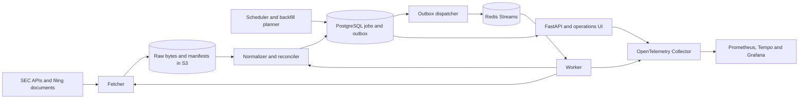

# SECRecon: implementation and milestone guide

Design baseline: 2026-09-09; implementation update: 2026-09-10. Project name: SECRecon. This is the living implementation contract. Check [PROJECT_STATE.md](PROJECT_STATE.md) for passed gates, pending acceptance work and the next task; future milestones are not claims of implemented functionality.

Quick navigation: [scope](#1-what-we-are-building) · [stack and Docker](#2-technical-stack-and-local-deployment) · [correctness contracts](#3-correctness-contracts) · [milestones](#4-milestones-and-acceptance-gates) · [API](#5-api-and-operator-contracts) · [testing and failure drills](#6-testing-gates-and-measurable-reliability) · [Git and CI/CD](#7-git-and-cicd-workflow) · [repository and commands](#8-planned-repository-and-command-map) · [session workflow](#9-working-together-without-losing-understanding).

## 1. What we are building

SECRecon collects SEC filings and financial facts, preserves their sources, processes them reliably, and explains where each value came from. Its central demonstration is recovery: duplicate delivery, failed dependencies, crashed workers, changed input schemas, and complete rebuilding of derived data.

The required release runs on the owner's computer with Docker Compose and no paid hosting. Continuous ingestion means continuous **while the computer and services are running**; restart performs catch-up. The portfolio deliverable is a reproducible system, documented engineering decisions, and recorded failure demonstrations.

Use this guide in three ways:

1. Before a session, read the current state and select one milestone slice.
2. During implementation, connect each change to its acceptance gate and user-visible demonstration.
3. At the end, record evidence and the next task. A future agent should need the guide, state file, and relevant code, rather than a repository-wide investigation.

### Required scope

| Area | First release |
| --- | --- |
| Companies | Five curated US companies initially; configurable watchlist, maximum 25 for the demo |
| Forms | 10-K, 10-Q, 10-K/A, 10-Q/A |
| History | Two years by filing date initially; configurable bounded backfills |
| Financial facts | Numeric, entity-level US-GAAP facts exposed through Company Facts; preserve source metadata |
| Raw sources | Submissions responses, historical submission pages, Company Facts responses, and selected filings' primary documents |
| Reconciliation | Explicit original/amendment comparisons within available fact coverage |
| Search | Company name/ticker/CIK, accession, form, filing date, concept, reporting period, job status |
| Operations | Jobs, attempts, DLQ, quarantine, backfill/replay status, provenance, telemetry |
| Interface | OpenAPI plus a small server-rendered operations interface |

Not required: all-market real-time coverage, custom-taxonomy or dimensional XBRL parsing, narrative document diffing, investment recommendations, full-text document search, multi-tenant accounts, Kafka, Kubernetes, or a separate SPA. Nightly bulk-archive ingestion is an optional extension after targeted backfills work. Do not add it to the critical path.

### SEC facts that shape the design

The SEC offers unauthenticated JSON endpoints and nightly bulk archives. Submissions history may span additional JSON files. Company Facts aggregates standard-taxonomy, entity-wide observations; it is not a complete filing-level XBRL representation. API publication can lag filing publication. These limits define our coverage and enrichment behavior. [SEC API documentation](https://www.sec.gov/search-filings/edgar-application-programming-interfaces)

SEC access guidance limits total traffic to ten requests per second across machines. Start at **two requests per second globally**, shared by incremental work and backfills, with an identifying User-Agent and contact address. Never load-test against the SEC. [SEC developer resources](https://www.sec.gov/about/developer-resources)

Derived design rules: preserve snapshots as observed; never promise to reconstruct an upstream response from before collection began. Treat missing financial facts as pending or unavailable, not automatically corrupt. Route SEC access through the backend. Follow historical submissions pages for backfills. Recheck supported schema assumptions with fixtures before implementing extraction.

## 2. Technical stack and local deployment

| Concern | Decision | Purpose |
| --- | --- | --- |
| Language and environment | Python 3.12; uv; pyproject.toml and uv.lock | One runtime and reproducible dependency installation |
| API and validation | FastAPI, Uvicorn, Pydantic 2, pydantic-settings | Typed contracts, OpenAPI, validated configuration |
| HTTP | HTTPX with explicit timeouts | SEC requests and deterministic HTTP test doubles |
| Database | PostgreSQL 17, SQLAlchemy 2, psycopg 3 | Transactions, constraints, job ownership, query indexes |
| Migrations | Alembic | Reviewed schema changes and deployment compatibility |
| Work distribution | Redis Streams using redis-py | Consumer groups, acknowledgements, reclaimable deliveries |
| Raw object storage | SeaweedFS single-node S3 mode; boto3 client | Free persistent local storage behind an S3 interface |
| Operator commands | Typer CLI | Ingest, inspect, replay, backfill, release and recovery helpers |
| Operations UI | FastAPI/Jinja2, plain CSS, minimal JavaScript | Searchable tables and detail pages with little frontend overhead |
| Instrumentation | OpenTelemetry SDK and Collector; structured JSON logs | Correlate processing across API, jobs and dependencies |
| Telemetry backends | Prometheus, Grafana, Tempo; Docker JSON logs initially | Metrics, dashboards and trace inspection; add Loki only if needed |
| Testing | pytest, Hypothesis, HTTPX/RESPX, real container dependencies | Properties, contracts, transactions and failures |
| Quality | Ruff formatting/linting, mypy, coverage, pip-audit | Fast feedback and dependency review |
| Load and faults | Locust, Toxiproxy, scripted process termination | Local repeatable performance and failure exercises |
| Packaging and delivery | Docker Compose, GitHub Actions, GHCR when enabled | Same application image through validation and release |

These are baseline major versions, not requests to install an arbitrary latest release. At M0, resolve compatible patches, check support and licenses, commit the lockfile, and pin infrastructure images by digest. Update through reviewed dependency PRs. PostgreSQL publishes its support lifecycle. [PostgreSQL versioning](https://www.postgresql.org/support/versioning/)

SeaweedFS supplies a local Docker S3 entry point. We will test the subset we rely on, including conditional creation, restart persistence and error handling; compatibility is not assumed for every AWS feature. [SeaweedFS documentation](https://github.com/seaweedfs/seaweedfs)

### Runtime layout

One repository, one application image, several entry points. Avoid separately deployed microservice codebases.



The fetcher, normalizer and reconciler are package modules invoked by workers. The dispatcher and scheduler can initially share one process. Redis is a delivery mechanism; PostgreSQL is authoritative for outstanding jobs and their state. Raw objects and manifests are the input archive for rebuilding derived financial data.

### Docker contract

- `compose.yaml`: postgres, redis, object-store, one-shot migrate/init services, API, worker, scheduler. Named persistent volumes; explicit health checks; internal dependency networking.
- `compose.dev.yaml`: optional source mounts and reload. Bind published ports to loopback.
- `compose.release.yaml`: immutable application image digest, no source mounts, non-root application user, restart policies, resource limits and rotated logs.
- `compose.test.yaml`: isolated test data, SEC HTTP stub and optional Toxiproxy. Cleanup may remove only that test project's volumes.
- `observability` profile: Collector, Prometheus, Grafana and Tempo. Provision dashboards and datasource configuration from Git.
- API, worker and scheduler use the same multistage Dockerfile. Migrations run once before compatible services start; never race on every worker startup.
- Dependency readiness must also be handled in code. Container startup ordering alone does not recover from a later database outage.
- Graceful shutdown stops claiming new jobs, finishes or abandons leased work safely, and leaves incomplete deliveries reclaimable.

Target a machine with 16 GB host memory; start with roughly 6 GB available to Docker and measure. On smaller machines run one worker and enable observability only for its milestone. Put local data and backups outside Git. Never use a general `down -v` helper against the release environment.

Docker documents separate production configuration for Compose deployments. We use that pattern for a **local release environment**, without claiming high availability. [Docker production guidance](https://docs.docker.com/compose/how-tos/production/)

### Hosting decision, including Vercel

The complete acceptance path is local. Development, CI and local release are the three initial environments. Local staging is an isolated Compose project started for release rehearsals, with its own database, bucket and Redis namespace; it need not run continuously.

Vercel is optional for a static case study or a future frontend. Its functions have bounded execution durations, so the chosen persistent Redis consumer and scheduler design is better run in containers. This is an architectural fit decision, not a claim that Python APIs cannot run on Vercel. [Vercel function duration](https://vercel.com/docs/functions/configuring-functions/duration)

A static online demo should use clearly labeled exported sample data. A hosted browser UI cannot access other visitors' copies of our localhost backend. Do not make a public live backend or a tunnel a prerequisite for the portfolio release.

If hosting becomes desirable later: deploy the release Compose stack to one Linux VM, keep raw sources and backups in an external S3 bucket, put HTTPS in front of the API, restrict administration, and measure cost before provisioning. Managed databases and always-on monitoring are later budget decisions. A single VM remains a single point of failure.

## 3. Correctness contracts

These rules are acceptance criteria, not optional refactoring goals.

### Source preservation and crash boundaries

Every HTTP attempt has a request ID and an auditable outcome. For completed responses, preserve the response body before parsing, including malformed or error bodies. Set explicit size limits; a truncated response must be labeled incomplete and must never enter normal processing. Transport failures record diagnostics without pretending a response exists.

Store body bytes in a content-addressed object such as `blobs/sha256/<hash>` and a separate create-only manifest at `events/<source_event_id>.json`. Define the hashed bytes precisely: HTTP entity body after transport decompression, before JSON parsing or reserialization. Record content encoding and storage encoding. Repeated identical responses can share a blob but have distinct fetch manifests.

Manifest fields: event ID, event schema version, URL, request/fetch timestamps in UTC, HTTP status, selected headers, SHA-256, byte length, media type, blob key, CIK/accession where known, fetcher version, and correlation ID. Content version is the checksum, separate from manifest schema and parser versions. Persist exact JSON numeric input; parse values as decimals.

Write the blob, then the manifest, then register the event and enqueue normalization in one PostgreSQL transaction. A manifest is the archive commit marker. If SQL fails after manifest storage, an inventory sweeper imports it later. A crash after blob storage but before its manifest can leave an unreferenced blob; it is not a completed source event. Refetch and flag incomplete request history. Do not delete orphan objects automatically in v1.

Use conditional creation, verify existing checksums on collision, and remove delete permissions from normal application credentials where supported. Conditional writes prevent overwriting an existing key in AWS S3; local support must pass the storage contract tests. This is application-enforced immutability, not a claim of regulatory WORM protection against a host administrator. [S3 conditional writes](https://docs.aws.amazon.com/AmazonS3/latest/userguide/conditional-writes.html)

### Data model and stable identities

| Entity | Identity and contents |
| --- | --- |
| `companies` | CIK as canonical identifier; ticker/name are mutable metadata |
| `filings` | Accession unique; CIK, form, filing/acceptance/report dates, primary document URL |
| `source_events` | Manifest event ID unique; raw body checksum and location; fetch metadata |
| `filing_sources` | Filing-to-source links by role: discovery, financial facts, primary document |
| `processing_runs` | Source event, parser version, projection generation, status and counts |
| `fact_observations` | Immutable observed assertion: CIK, accession, taxonomy, concept, unit, instant or duration dates, decimal value, source metadata |
| `fact_provenance` | Observation-to-source event and exact JSON path/record locator, processing run |
| `amendment_links` | Candidate original/amendment relationship, evidence, status, matching-rule version |
| `reconciliation_runs` / `fact_changes` | Explicit pair, input snapshot IDs, algorithm version, comparison results and coverage |
| `jobs` / `job_attempts` | Durable work, due time, lease and fencing token; append-only attempts |
| `outbox` / `job_events` | Pending notifications; append-only processing transitions |
| `backfills` / `replays` | Scope, checkpoints, counts, target generation and status |
| `quarantine_records` | Raw reference, validation paths, reason and adapter version |

Use database unique constraints as the final duplicate barrier. Financial values use Python `Decimal` and PostgreSQL `NUMERIC`, never binary float. Return decimal values as API strings to avoid browser rounding. Store original value text where available. UTC for timestamps; retain filing and financial-period dates as dates.

A comparison key is `(CIK, taxonomy, concept, unit, period_kind, start_date, end_date)`. Instant facts have no start date; implement null-safe uniqueness explicitly. Accession belongs in the observation identity but not in the cross-filing comparison key. Preserve fiscal year/period and frame as metadata; they are not substitutes for actual dates.

An observation fingerprint additionally includes accession, value and meaningful source qualifiers. Identical observations from later snapshots gain provenance links without duplicate financial rows. Conflicting values for the same logical key remain visible and ambiguous. A changed snapshot for one accession is an upstream observation revision, not automatically a legal amendment. Projection output uniqueness includes the generation/parser policy.

### Durable work, idempotency and concurrency

Processing is **at least once**, with idempotent database effects. No end-to-end exactly-once claim.

1. API or scheduler commits a durable job and outbox row together. Business idempotency keys prevent duplicate scheduling; API idempotency keys also bind a request-body hash.
2. Dispatcher adds a small message containing `job_id` and trace context to Redis, then marks its outbox row sent. A crash can duplicate delivery; it cannot erase the SQL job.
3. Worker atomically claims a due job in PostgreSQL, increments a fencing token, and sets an expiring lease. Use a 60-second initial lease and heartbeat every 15 seconds; tune using measured durations.
4. Worker performs bounded external work outside a long SQL transaction. Final transaction locks the job row and verifies the token and lease, then commits facts, provenance, attempt outcome, state transition and downstream outbox together.
5. Acknowledge Redis only after a durable state decision. SQL unavailable means no success acknowledgement. A stale worker cannot commit using an expired token, even if it finishes late.
6. A sweeper reclaims expired leases and republishes due, unfinished SQL jobs missing delivery. This also recovers from total Redis data loss; outbox rows marked sent alone are insufficient for that recovery.

Redis consumer groups support pending-message recovery and acknowledgements. That does not replace SQL fencing: two workers can briefly execute after a lease takeover, but only the valid owner may commit. [Redis Streams](https://redis.io/docs/latest/develop/data-types/streams/)

Serialize projection commits per accession and generation using a transaction-scoped lock and uniqueness constraints. Always acquire locks in a documented order. Version candidate outputs so a late older snapshot cannot replace a newer selected snapshot. Use fetch timestamp plus event ID as deterministic ordering, not worker completion time.

### Retry, dead-letter and quarantine policy

State model: `queued -> running -> succeeded`; failures lead to `retry_wait`, `dead_letter`, or `quarantined`. Expired running work becomes eligible for recovery. Cancellation stops scheduling/claiming additional work and records what already committed.

Transient failures include network timeouts, selected 5xx responses, 429s and dependency outages. Start with five attempts total, exponential backoff with full jitter, 5-second base and 15-minute cap. Respect a longer valid Retry-After. Persist due times in SQL; do not sleep in a worker to schedule retries. A dead-letter record preserves error category, sanitized details, attempts and source references. Redrive creates a linked new job, preserving the old terminal history.

403s pause SEC fetching and surface configuration/access diagnostics; do not evade blocking. Treat a newly discovered but unavailable document as temporarily pending within a bounded policy; repeated missing data becomes an inspectable coverage gap. Facts availability gets a separate enrichment policy: recheck at 1, 5 and 30 minutes, then at 6 and 24 hours, with a daily capped revisit for seven days. Afterward mark unavailable, with manual refresh possible. Missing facts alone are not a poison message.

Schema-invalid or checksum-invalid sources enter quarantine immediately. Unknown optional fields produce warnings and are preserved. Missing required structures, unequal submissions column lengths, invalid types and conflicting fact shapes block that projection atomically. A new adapter version must pass old and new fixtures before replaying quarantined inputs. Never repair the preserved payload in place.

### Incremental ingestion, backfills and replay

Poll the watchlist every 15 minutes, with jitter. Store each company's last successful poll and schedule catch-up on restart. Revisit a seven-day overlap and deduplicate by accession; do not rely only on a maximum date. Fetch Company Facts on relevant discoveries and periodically refresh for observed upstream changes. Periodic refreshes and pending-enrichment jobs close publication gaps.

The global SEC rate limiter uses atomic Redis state and fails closed during Redis failure. Run only one local environment in live SEC mode by default. CI and staging use fixtures. If independent deployments later fetch simultaneously, they must share or explicitly divide a single aggregate request budget.

Backfill requests specify CIKs and inclusive filing-date bounds. Date-only requests operate on the configured watchlist, not the entire market. Follow historical submissions pages, checkpoint discovery chunks, cap job counts, and prioritize incremental work over backfills. Cancellation leaves preserved sources and committed facts intact. Repeating or overlapping a backfill converges to the same financial state.

Replay reads manifests and blobs into a **new projection generation**, with a pinned parser/reconciliation version and no SEC access. It validates checksums, uses deterministic ordering, and computes a canonical sorted digest of financial output excluding generated IDs, processing timestamps and attempt history. Same inputs and versions must produce the same digest. Changed parsers can produce intentional differences, recorded in a comparison report. Switch the active generation only after validation, retaining the previous generation for rollback.

Two recovery guarantees must stay distinct:

- **Derived-data rebuild:** recreate filings, observations, provenance and deterministic reconciliation from preserved manifests, documents, JSON and versioned configuration. Manual amendment-link overrides must be exported as immutable control events and included in replay inputs if used.
- **Full operational restore:** recover job attempts, operator actions and processing history from PostgreSQL backups plus archived sources. SEC payloads cannot tell us which local worker failed six months ago. Redis can be recreated from unfinished SQL jobs.

### Amendment semantics

An `/A` form identifies an amendment, but a matching original may be ambiguous. Candidate links require same CIK, base form and report period, with an earlier filing. Preserve evidence, apply a versioned rule, and report unresolved links. Explicit pair comparison is available even when automatic linkage is unresolved. Manual decisions record actor, reason and replayable control event.

Compare facts belonging to the explicit accessions within selected, preserved source snapshots. Return `changed`, `unchanged`, `only_in_original`, `only_in_amendment`, or `ambiguous`. “Only in original” does **not** mean deleted: amendments can omit unchanged financial information. An amendment without accessible XBRL facts returns an incomplete-coverage result, not a claim that every fact disappeared.

Do not compare different units, periods or concepts as though they were identical. Show exact decimal delta only for comparable numeric facts. Do not infer currency conversion, concept equivalence, or a restatement from a later filing that repeats an earlier reporting period. Every result exposes its coverage, source event IDs, parser version, comparison version and evidence links.

## 4. Milestones and acceptance gates

Suggested pacing is eight weeks at roughly 10–15 focused hours per week. It is a planning estimate; reliability work may take longer. Finish gates in order. If time is tight, reduce companies, UI polish and optional hosting before removing replay or failure tests.

| Milestone | Suggested timing | User-visible outcome |
| --- | --- | --- |
| M0 | Week 1, first half | Start the environment and run the checks |
| M1 | Weeks 1–2 | Trace one normalized value to preserved source bytes |
| M2 | Week 3 | Duplicate and crash processing safely |
| M3 | Week 4 | Catch up, backfill, and rebuild offline |
| M4 | Week 5 | Explain an amendment and handle schema change |
| M5 | Week 6 | Inspect jobs, facts, traces and queue health |
| M6 | Week 7 | Demonstrate failures and publish measurements |
| M7 | Week 8 | Install a tagged release, restore it, and explain the system |

### M0 — Foundation and reproducible development

**Slices:** M0.1 package/tooling/settings/health API; M0.2 Docker dependencies and migrations; M0.3 CI, fixture harness and repository conventions.

Build `src/secrecon`, tests, lockfile, Ruff/mypy configuration, `.env.example`, `.gitignore`, initial Alembic setup, health endpoints and shared check commands. Record architecture decisions for scope, storage and job ownership. Prepare GitHub workflows without assuming the repository has been published.

**Gate:** a clean checkout can start dependencies, migrate an empty database, serve liveness/readiness, and run lint, types and the initial meaningful smoke tests. Missing configuration fails clearly. Restart persistence is checked. CI runs the same checks once a remote exists; before that, record local-only evidence and leave the remote CI gate pending.

**Owner demonstration:** explain why the lockfile and container image make another machine reproducible. Distinguish a running process from a service ready to answer queries.

### M1 — Immutable sources and normalized facts

**Slices:** M1.1 SEC client and archived responses; M1.2 schema and normalization; M1.3 provenance query and real fixture selection.

Start with an operator-run vertical slice for one company. Preserve discovery JSON, fact JSON and a primary filing document. Implement manifests, checksum validation, exact numeric handling and atomic projection writes. Choose five companies and a real original/amendment pair; manually verify available comparison facts. Create fixture manifests with source URL, retrieval date, checksum and expected assertions. Keep a labeled synthetic changed-value pair for deterministic tests if real examples do not expose that change.

**Gate:** process the same fixture five times; financial rows and canonical output remain unchanged, while intentional fetch/attempt history remains explainable. Trace a returned value to a JSON locator and checksum, and separately to its filing document. Exercise blob/manifest/SQL crash boundaries and object-store restarts. Conflicting values are retained. A malformed response is preserved and rejected without partial facts.

**Owner demonstration:** point to the exact source of one decimal value and explain why its accession and reporting period matter. State the limits of Company Facts coverage.

### M2 — Durable jobs, ownership, retries and dead letters

**Slices:** M2.1 SQL jobs/outbox and Redis delivery; M2.2 leases/fencing/recovery; M2.3 retry classification, DLQ and redrive.

Convert the M1 slice to worker jobs. Build dispatcher, sweeper, attempt history, delayed retry scheduling, worker shutdown and job inspection. Make retries visible in SQL and structured logs.

**Gate:** two workers racing 100 duplicate deliveries create one committed projection. Kill a worker before commit and after commit/before acknowledgement; both converge correctly. A stale lease holder is rejected at commit. Demonstrate outbox double-publication, Redis restart/data loss, database unavailability and retry exhaustion without losing accepted work. A DLQ redrive preserves prior attempts.

**Owner demonstration:** explain the outbox, a lease, a fencing token, and why receiving the same message twice is expected.

### M3 — Incremental ingestion, backfills and offline rebuilds

**Slices:** M3.1 scheduler/rate limits and pending enrichment; M3.2 resumable backfills; M3.3 raw inventory and shadow-generation replay.

Add watchlists, durable cursors, overlap, historical-page traversal, source refreshes, priority and cancellation. Implement manifest inventory repair. Replay derives fresh projections from stored sources and versioned inputs without HTTP access.

**Gate:** stop/restart polling across a simulated gap; discover each eligible accession. Crash a multi-page backfill halfway, resume, then overlap it with another request. Compare with a clean run. Simulate submissions arriving before facts. Enforce the configured request budget under multiple workers. Rebuild from archive into an empty target with networking to SEC disabled; canonical digests match. Corruption prevents promotion, and the old active generation remains available.

**Owner demonstration:** explain the difference between re-fetching, retrying, replaying and restoring a backup.

### M4 — Reconciliation and schema evolution

**Slices:** M4.1 accession comparisons; M4.2 candidate linkage and coverage; M4.3 schema quarantine and versioned reprocessing.

Implement immutable comparison runs and inspectable results. Cover unchanged, changed, original-only, amendment-only and ambiguous assertions. Preserve source-snapshot revisions separately from amendments. Add adapter versioning and structured schema diagnostics.

**Gate:** verified fixtures cover changed values, unchanged values, amendments without financial facts, ambiguous originals, conflicting observations, instant/duration and unit mismatches. Add an optional field without breaking valid extraction; change a required type and quarantine it. Introduce a compatible adapter, replay, and compare generations. Old fixture behavior remains stable. Show one real pair and clearly labeled synthetic failure/change examples.

**Owner demonstration:** explain why an absent amendment fact is not a deletion and how parser upgrades preserve old evidence.

### M5 — Query API, operations and observability

**Slices:** M5.1 indexed API and pagination; M5.2 job/provenance/reconciliation UI; M5.3 telemetry, dashboards and alerts.

Add the endpoints below, a restrained operations interface, API error contracts and authenticated administration. Carry correlation IDs and trace context in job messages and attempt records. Instrument from source fetch to database commit; export telemetry through the Collector.

**Gate:** deterministic cursor pagination and filters have integration coverage. Unauthorized administration fails, while valid requests create auditable jobs. One fact links to its provenance; one failed job links to attempts and a trace. Test queue and retry metrics against controlled SQL state. Simulate lag and trigger an alert condition. Telemetry backend failure must not block ingestion or grow buffers without bounds.

**Owner demonstration:** locate a failed ingestion without reading every log, and explain which component caused the delay.

### M6 — Failure demonstrations and performance evidence

**Slices:** M6.1 repeatable fault harness; M6.2 performance baseline; M6.3 recovery report and limitations.

Run the failure matrix below against fixture-driven Compose environments. Use explicit readiness/state predicates around injected failures, not tests that succeed because of arbitrary sleeps. Record software versions, dataset, machine resources, commands, expected invariants, actual output and timings.

**Gate:** required drills pass three consecutive local runs with no unexplained duplicates or lost accepted jobs. Publish benchmark results and identify the bottleneck. Missing a proposed speed target requires a written explanation and a revised evidence-backed target, not hiding the result. Correctness failures block the milestone.

**Owner demonstration:** kill a worker live, show recovery, then replay into a new generation and compare output digests.

### M7 — Local release, CI/CD rehearsal and portfolio handoff

**Slices:** M7.1 release image and staging promotion; M7.2 backups, restore and rollback; M7.3 walkthrough, case study and tagged release.

Build a release from a tested commit, install the exact artifact into isolated local staging, then local release. Rehearse migrations, worker draining, smoke tests, rollback and database restore. Write operator runbooks and a short postmortem for one injected incident. Record a 5–8 minute walkthrough and retain a text walkthrough for reproducibility.

**Gate:** a fresh checkout follows documented steps successfully. Restore PostgreSQL plus the raw archive into an isolated environment and verify data/provenance/audit history to the backup cutoff. Rebuild derived data independently. Roll back a compatible application release using the prior image digest. Document recovery time and backup loss window. All milestone evidence is linked from the state file and v0.1.0 release notes.

**Owner demonstration:** explain the system in five minutes and answer what happens if Redis, the database, the worker or the local disk fails. Public hosting is not a release gate.

## 5. API and operator contracts

These are planned interfaces; implement and document exact schemas as their milestones arrive.

| Route | Purpose |
| --- | --- |
| `GET /health/live`, `GET /health/ready` | Process health; query-service readiness including DB/schema |
| `GET /v1/companies` | Filter by ticker/name/CIK |
| `GET /v1/filings` | Filter by company, form and filing-date range |
| `GET /v1/filings/{accession}` | Metadata, source documents and coverage |
| `GET /v1/facts` | Accession/concept/period filters; explicit projection generation |
| `GET /v1/facts/{id}/provenance` | Immutable source references, locator and parser version |
| `POST /v1/admin/reconciliations` | Enqueue an explicit accession-pair comparison |
| `GET /v1/reconciliations/{id}` | Comparison results and coverage |
| `GET /v1/admin/jobs`, `GET /v1/admin/jobs/{id}` | Status, transitions and attempt history |
| `GET /v1/admin/quarantine` | Inspect rejected sources and schema diagnostics |
| `POST /v1/admin/backfills`, `POST /v1/admin/replays` | Start bounded background operations |
| `GET /v1/admin/backfills/{id}`, `GET /v1/admin/replays/{id}` | Progress and outcomes |
| `POST /v1/admin/jobs/{id}/redrive` | New linked attempt sequence after investigation |
| `POST /v1/admin/backfills/{id}/cancel` | Stop future work while retaining committed results |

Long-running POST operations return HTTP 202 and an operation ID; never hold the request open for a backfill. Require `Idempotency-Key` for these actions: same key/body returns the same operation, different body returns 409. Validate allowed CIKs, forms, dates, scope limits and source hosts. Do not accept arbitrary fetch URLs.

Read routes use stable keyset pagination, default 50/max 200. Return freshness, active generation and coverage metadata. “Latest” must mean a documented source-snapshot selection, not silently the largest fiscal year. Use parameterized queries and query timeouts; avoid unbounded fact exports.

Local administration uses a configured secret token; never a committed default. The same-origin UI uses a server-issued HttpOnly session and CSRF protection for browser mutations; CLI/API uses bearer authentication. Bind services to loopback and sanitize errors and logs. A future public deployment needs HTTPS, rate limiting, restricted admin access and secret management before exposure.

Raw SEC HTML must not execute on the application's origin. Link to the SEC original or serve preserved bytes as an attachment from a restricted download endpoint. Store credentials outside Git; object-store and database ports remain internal unless explicitly enabled for local debugging.

## 6. Testing gates and measurable reliability

| Layer | What it proves | When |
| --- | --- | --- |
| Unit and property | Decimal preservation, normalization identity, matching, retry classification, schema rules | Each relevant change |
| Contract fixtures | SEC response assumptions, column alignment, missing/delayed facts, unexpected fields | Every PR affecting ingestion |
| Integration with PostgreSQL/Redis/S3 | Constraints, transaction rollback, fences, outbox, storage semantics | Every behavioral PR |
| Migration | Empty DB to head; previous released schema/data to head; one Alembic head | Every PR with schema change, plus release |
| End-to-end offline | Stub SEC -> archive -> jobs -> facts -> provenance -> comparison | Each merged release candidate |
| Fault/recovery | Crash boundaries, dependency failure, DLQ, replay and restore | M2 onward targeted; full suite M6/release |
| Performance | API latency, throughput, queue-drain rate, memory and query plans | M6 and significant performance changes |
| Optional live smoke | Identifying SEC request and bounded real-company ingestion | Manual only, never required PR CI |

SQLite is not an acceptable substitute for PostgreSQL correctness tests. Mocks do not establish queue/storage/database durability. Use fixed clocks or controllable clock interfaces for scheduling tests. Keep default tests offline and deterministic.

Set an initial 80% branch-coverage floor for domain/worker correctness modules when substantive implementation exists; scenario coverage still determines acceptance. Do not pad coverage with tests that simply mirror setters or mocks. Record any justified exception. No unresolved financial data loss, duplicate committed effect, provenance gap or stale-owner commit is acceptable.

### Initial performance targets, to validate in M6

These are proposed acceptance budgets, not measured claims. Freeze the dataset and resource allocation before timing.

- 100,000 synthetic fact observations across 1,000 filing-shaped fixtures, with 10% duplicate deliveries; fixture metadata identifies synthetic companies/accessions.
- Four workers replay the dataset in under ten minutes on the recorded reference machine; correctness digest must match a single-worker baseline.
- At 20 local read requests/second for ten minutes, p95 under 300 ms for indexed list/detail queries, errors under 1%, max page 100. Report cold and warmed results separately.
- Recover a crashed worker's eligible job within 120 seconds under the configured 60-second lease. Correctness remains mandatory if machine contention misses the timing goal.
- While running and upstream data is available, aim for p95 discovery-to-normalized lag below 20 minutes at the demo watchlist size. Track SEC acceptance-to-discovery separately so upstream delay is visible.
- No unbounded queue, connection, memory or telemetry-buffer growth during a 30-minute fixture soak. Capture actual peak memory and queue drain rate.

### Required failure matrix

| Injection | Required observation |
| --- | --- |
| Deliver identical work repeatedly to two workers | One committed financial effect; duplicate delivery visible |
| Kill worker before transaction commit | Lease expires; another worker completes; no partial projection |
| Kill worker after commit before Redis acknowledgement | Redelivery sees durable completion and acknowledges safely |
| Stall worker past lease, then resume it | Old fencing token cannot commit |
| Stop database mid-processing | No false success acknowledgement; reconnection or inspectable exhaustion |
| Restart Redis and separately erase test Redis data | SQL outstanding work is republished and completes |
| Fail object storage between blob and manifest/SQL steps | Incomplete work visible; committed manifests recovered; no false durable-source claim |
| Change bytes in a copied test object | Checksum mismatch quarantines; promotion blocked |
| Change a required source field's type | Schema quarantine with exact path; adapter upgrade enables replay |
| Return 429/5xx and then recover from the SEC stub | Global limiting and persisted backoff; finite attempts |
| Crash/resume a backfill; deliver older sources late | Complete discovery and deterministic final generation |
| Delete only the isolated derived projection | Offline replay reconstructs canonical financial output |
| Restore from a database/raw backup into a fresh test stack | Operational history matches the backup cutoff; replay handles archived inputs afterward |

Fault commands must select an explicit test/staging project and refuse the local release project by default. Corrupt copies, not the retained evidence archive. Each drill report includes before/after SQL assertions and the relevant trace/log IDs.

### Observability contract

OpenTelemetry provides the instrumentation model for traces, metrics and logs. Backends store and display those signals; they do not replace the durable processing audit. [OpenTelemetry signals](https://opentelemetry.io/docs/concepts/signals/)

Track queue depth from SQL runnable/retry/running counts and Redis pending entries separately. Track oldest eligible job age, outbox age, watchlist poll freshness, ingestion lag, success/failure rates, retry totals, DLQ/quarantine counts, job duration, SEC response status and archive-write failures. Exclude deliberate future retries from runnable backlog.

Use job ID, accession, source event ID, projection version and trace ID in logs/traces. Avoid these high-cardinality identifiers as Prometheus labels. Labels should be bounded categories such as job type, outcome and error class. Store attempt history regardless of telemetry sampling. Disable telemetry exports from blocking the application; bound buffers and expose dropped-signal counts.

Initial alerts: oldest runnable job over five minutes, no successful poll for 30 minutes while the scheduler is enabled, any new DLQ/quarantine item, persistent archive failure, and sustained dependency errors. Document no-traffic and computer-off behavior so silence is not mistaken for health.

## 7. Git and CI/CD workflow

### Git conventions

M0 establishes `main` as the default branch when the initial repository history is created; the design session found an empty `master` branch. Keep one short-lived branch per slice, e.g. `feat/m2-worker-fencing`. Per the owner's preference, branch names must exclude `codex`; use descriptive `feat/`, `fix/`, `test/` or `docs/` prefixes. Use PRs, squash merge, and descriptive commits such as `feat(worker): reject expired lease commits` or `test(replay): verify snapshot ordering`.

Link PRs to milestone/slice IDs. PR descriptions state the problem and resulting behavior, tests, migration impact and material risks. Keep migrations in the same PR as the code that needs them. Record architecture decisions under `docs/adr/NNNN-title.md`: context, decision, alternatives, consequences and validation.

Protect `main` with required checks and prevent force pushes when repository settings allow. A solo owner can review their own diff and record a checklist; do not require an impossible second-person approval. Tag milestone checkpoints only after gates pass. Use `v0.1.0` for the first complete local release. Never tag a plan as working software.

Ignore `.env`, credentials, virtual environments, local databases, large raw archives, backups and benchmark bulk data. Commit small fixtures with provenance, lockfiles, migrations, infrastructure configuration and sanitized evidence. Do not publish the repository or SEC-contact information merely to enable CI without an owner decision.

### Continuous integration

Implement workflows incrementally:

| Workflow | Trigger | Gate/output |
| --- | --- | --- |
| `ci.yml` | PR and main push | Frozen dependency install, Ruff, mypy, unit/property/contract/integration tests, migration checks, Compose config validation, image build |
| `recovery.yml` | Manual initially; later scheduled if quota permits | Full offline failure/replay suite, bounded runtime, retained reports |
| `release.yml` | Version tag or explicit manual release | Recheck eligible commit; build/publish versioned image when registry enabled; scan, SBOM and digest manifest |
| `staging.yml` | Release artifact ready | Test the exact image in ephemeral isolated Compose, migrate, seed fixtures and smoke-test |

Pin external Actions to commit SHAs and use minimum permissions. PR jobs have read-only repository access and no deployment secrets. Do not run untrusted fork code in a privileged workflow or a persistent laptop runner. Use timeouts and cancel obsolete PR runs; serialize release operations without canceling a migration already in progress.

GitHub documents free standard hosted-runner use for public repositories; private repositories have plan-specific quotas. Until visibility is chosen, local checks are the working default. Keep artifact retention short and heavy scheduled suites disabled initially. [GitHub Actions billing](https://docs.github.com/en/billing/concepts/product-billing/github-actions)

### Delivery and local deployment

The initial model is continuous delivery: CI prepares a validated artifact, and the owner invokes a local deployment command. A GitHub-hosted runner cannot directly install into a sleeping laptop. No self-hosted runner is required.

If GHCR is not enabled, export the tested image as an OCI artifact and checksum, then load that artifact locally. If GHCR is enabled, pull by immutable digest. Do not rebuild from source separately for each environment. Preserve an image/config/schema manifest for each local release.

Deployment procedure:

1. Verify clean release identity, passing gates, available disk, configuration and compatible schema range.
2. Back up PostgreSQL and raw manifests/blobs; verify the backup inventory. Pause scheduling and drain or safely abandon leased work.
3. Run the migration job once, under a deployment lock. Fail without starting incompatible application processes.
4. Start the exact tested image in local staging, run offline ingestion/provenance smoke tests, and record results.
5. Apply the same artifact to local release after its own backup/preflight/migration sequence. Resume workers/scheduler and verify readiness plus a bounded fixture job.
6. Record artifact digest, schema revision, configuration version, checks, timestamps and previous release for rollback.

Use additive expand/contract migrations: add schema first, deploy compatible code, backfill, and remove old schema in a later release. Test upgrades with populated data. Application rollback uses the previous compatible image; do not promise automatic destructive Alembic downgrades. If a migration is incompatible, restore the tested backup or deploy a forward fix using the recovery runbook.

If cloud deployment is added, GitHub `staging` and `production` environments hold separate credentials and deployment rules. Feature availability depends on repository visibility and plan; check before relying on manual reviewers. Use environment-scoped secrets and short-lived credentials where supported. [GitHub deployment environments](https://docs.github.com/en/actions/reference/workflows-and-actions/deployments-and-environments)

### Backup and recovery objectives

During local development, create a database dump before migrations and after work sessions with meaningful ingestion. Snapshot the archive inventory and preserve matching blobs/manifests. Keep at least seven daily backups and four weekly backups when space permits. Log backup failures and never silently prune raw sources to meet a disk cap; pause ingestion and surface the condition.

Proposed local operational recovery point: the most recent completed backup, no more than 24 hours old while the environment is in active daily use. Proposed recovery time: under 60 minutes for the demo dataset, measured in M7. These are objectives, not guarantees.

A backup on the same disk protects against accidental logical damage, not disk loss. An external drive or another existing storage location is needed for host-loss recovery; if unavailable, state that limitation in the case study. Archive-only recovery can reconstruct financial projections but cannot recreate lost operational audit entries. Test both procedures separately.

## 8. Planned repository and command map

The core package, migrations, fixtures, tests and CI are now implemented. The following target layout also includes later M4–M7 work; the state file identifies what exists today:

```text
src/secrecon/
  api/                 routes, schemas, authentication and UI
  domain/              fact identity and reconciliation rules
  ingestion/           SEC client, discovery and adapters
  storage/             S3 archive and manifests
  db/                  SQLAlchemy models and repositories
  jobs/                outbox, leases, worker, retries and sweeper
  orchestration/       polling, backfills and replay
  telemetry/           tracing, metrics and logging
  cli.py               operator entry point
migrations/            Alembic revisions
tests/
  unit/ contract/ integration/ e2e/ fault/
  fixtures/            small recorded and labeled synthetic sources
benchmarks/            dataset generator and Locust scenarios
ops/                   dashboards, Collector and release configuration
scripts/               repeatable checks, deployment and fault entry points
docs/
  PROJECT_GUIDE.md      durable scope and implementation contracts
  PROJECT_STATE.md      current position and session evidence
  adr/                 decisions and tradeoffs
  runbooks/            start, DLQ, quarantine, replay, restore, deploy
  evidence/            compact reports and links to larger artifacts
.github/workflows/     checks and artifact delivery
compose*.yaml          environments and profiles
Dockerfile             shared application image
pyproject.toml / uv.lock
```

Command map: ingestion, jobs, backfills and replay are implemented. The fault `drill` CLI and release `deploy` CLI are future M6/M7 interfaces; use `scripts/service_drills.py` for the current isolated dependency drill. See the operations runbook for exact supported arguments.

| Task | Target command |
| --- | --- |
| Install locked dependencies | `uv sync --frozen` |
| Lint, format check, types | `uv run ruff check .`; `uv run ruff format --check .`; `uv run mypy src` |
| Run offline unit tests | `uv run pytest tests/unit tests/contract` |
| Start development stack | `docker compose -f compose.yaml -f compose.dev.yaml up -d --build` |
| Migrate | `docker compose run --rm migrate` |
| Ingest a company | `uv run secrecon ingest --cik <CIK>` |
| Backfill | `uv run secrecon backfill --cik <CIK> --from <YYYY-MM-DD> --to <YYYY-MM-DD>` |
| Replay into a fresh generation | `uv run secrecon replay --generation <NEW_NAME> --offline` |
| Inspect work | `uv run secrecon jobs list --status dead_letter` |
| Run failure scenario | `uv run secrecon drill worker-crash --environment test` |
| Deploy tested local artifact | `uv run secrecon deploy --environment local-release --manifest <PATH>` |

Command implementations must resolve environment targets explicitly, document prerequisites and share logic with API operations. Update this table when actual commands differ. Provide container equivalents so a host Python installation is optional after images are available.

## 9. Working together without losing understanding

Each implementation session should deliver a small capability with a short explanation: what now works, why the design is needed, how it was checked, and what the owner should try. Keep these explanations tied to concrete observations: a duplicate message, a database row, a preserved manifest, or a trace.

Before closing a milestone, the owner should be able to perform its demonstration and explain the corresponding concept in their own words. This is a learning checkpoint, not an additional permission requirement. Record unanswered questions in the state file and address them in the next slice.

Definition of done for a slice: implementation matches its contract, appropriate checks pass, migrations/configuration are documented, state and evidence are updated, and the next task is concrete. Definition of done for the project: M0–M7 gates pass, remaining coverage and hosting limitations are explicit, and someone else can reproduce the core failure and recovery story from the repository.

Suggested prompt for a future implementation agent:

> Read AGENTS.md, docs/PROJECT_STATE.md and the relevant milestone in docs/PROJECT_GUIDE.md. Implement the next incomplete slice, preserving the local/free scope. Explain the behavior and engineering concept, run the required checks, and update the state file with evidence and the next task. Do not claim planned features are already implemented.

The next step is maintained in **PROJECT_STATE.md**. Do not restart from M0 or assume later milestones exist merely because they appear in this guide.
